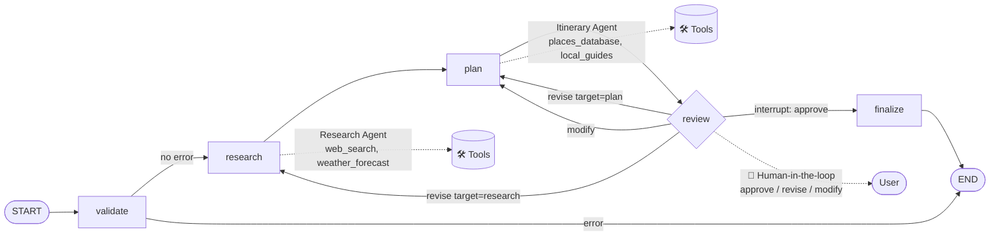
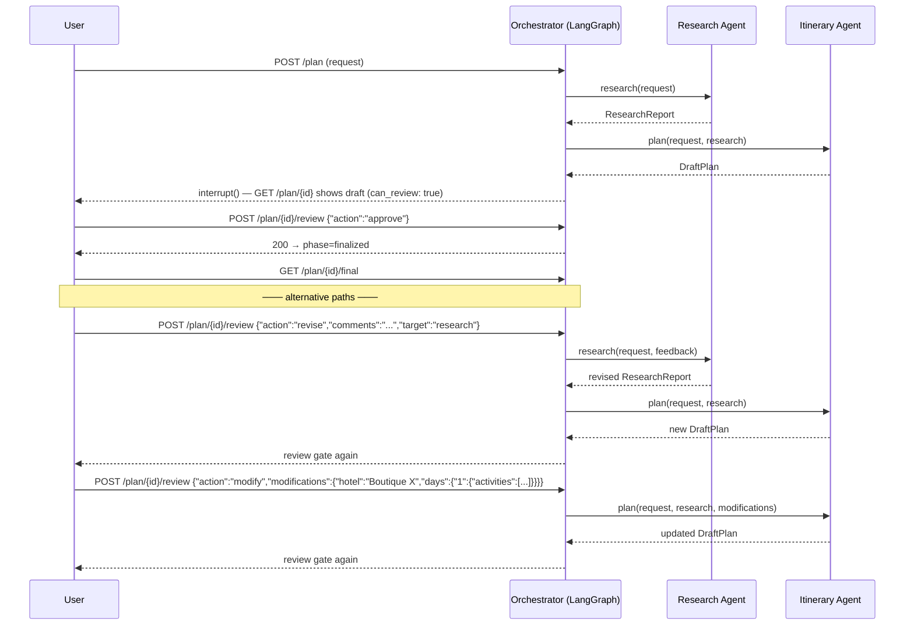

<div align="center">

# ✈️ AI Travel Planner

**A multi-agent travel planning system with human-in-the-loop approval**

Built with **Python · LangGraph · FastAPI**

`Research Agent` → `Itinerary Planner Agent` → 👤 *you approve, revise, or modify* → ✅ final plan

[]()
[]()
[]()
[]()
[]()

</div>

---

## Table of contents

1. [What it does](#what-it-does)
2. [Features](#features)
3. [How it works](#how-it-works)
4. [Architecture](#architecture)
5. [Human-in-the-loop flow](#human-in-the-loop-flow)
6. [The agents & their tools](#the-agents--their-tools)
7. [State & persistence](#state--persistence)
8. [Project structure](#project-structure)
9. [Getting started](#getting-started)
10. [Using real providers (LLM / web search)](#using-real-providers-llm--web-search)
11. [Run the HTTP API](#run-the-http-api)
12. [Run the CLI demo](#run-the-cli-demo)
13. [Run the tests](#run-the-tests)
14. [API reference](#api-reference)
15. [Design decisions & tradeoffs](#design-decisions--tradeoffs)
16. [What I'd improve with more time](#what-id-improve-with-more-time)
17. [Production readiness](#production-readiness)
18. [Assumptions](#assumptions)

---

## What it does

A user submits a travel request — destination, dates, budget range, interests,
and number of travelers. The system:

1. **Researches** the destination (attractions, safety, weather, seasonal tips).
2. **Builds** a complete day-by-day itinerary (activities, hotels, restaurants,
   budget split, packing list, local tips) that fits the budget.
3. **Pauses for your review** and supports three human-in-the-loop actions:
   - **Approve** — accept the plan as-is.
   - **Revise** — leave comments; the relevant agent re-does its work.
   - **Modify** — change specific parts (a hotel, a day's activities, the budget).
4. **Finalizes** the plan — *only* after your approval — and serves it from a
   dedicated endpoint.

Everything runs as a **stateful LangGraph workflow** served by **FastAPI**, with
every intermediate/final state persisted to **SQLite**. If the API server is
restarted mid-review, the plan survives and can still be approved when it comes
back up.

---

## Features

- ⚙️ **LangGraph `StateGraph` orchestrator** — explicit `validate → research →
  plan → review → finalize` state machine with conditional re-routing.
- 🛑 **True human-in-the-loop** via LangGraph's `interrupt()` — the graph *pauses*
  at a review gate and is resumed with `Command(resume=...)`; no polling hacks.
- 🧠 **Two specialized agents** (Research, Itinerary Planner), each with exactly
  two tools, wrapped in a small transparent **ReAct loop**.
- 🔎 **Live web search** (mandatory tool) with three backends: **Serper**, **Exa**,
  or a **curated mock**.
- 🌤️ **Keyless weather** via **Open-Meteo**, with offline fallback.
- 🗄️ **SQLite checkpointing** — state persists across pauses *and* server restarts.
- 📄 **Schema-validated documents** with a deterministic repair fallback — the API
  never returns a malformed plan, even if an LLM misbehaves.
- 🧪 **Offline-first**: runs end-to-end with **zero API keys**, which doubles as a
  hermetic test double (15 passing `pytest` tests).
- 🔌 **Provider-agnostic**: OpenAI / Anthropic / mock LLM; Serper / Exa / mock web
  search; Open-Meteo / mock weather — all configurable via `.env`.

---

## How it works

```
 User submits a request (POST /plan)
        │
        ▼
┌──────────────────────────────────────────────────────────────────────┐
│                 ORCHESTRATOR — LangGraph StateGraph                  │
│                                                                      │
│   validate ──▶ research ──▶ plan ──▶ review ──▶ finalize ──▶ END    │
│                │            │         │  ▲                          │
│    (input checks)           │         │  └─ approve ─────────────────┤
│                             │         ▼                             │
│                             │   interrupt() ── HUMAN PAUSE          │
│                             └──◀─ revise (target: research|plan)    │
│                                    modify (override parts of plan)  │
└──────────────────────────────────────────────────────────────────────┘
```

The graph is the source of truth. It reads from and writes to a single state
object (the current request, research report, draft plan, feedback, phase, …).
Because each node receives the full state and returns only its deltas,
LangGraph can **checkpoint** the state at every step.

### The lifecycle in detail

| Stage | What happens | Node |
| ----- | ------------ | ---- |
| **validate** | Re-validates the request (defense-in-depth on top of API validation). | `validate` |
| **research** | The Research Agent calls `web_search` + `weather_forecast`, then composes a structured `ResearchReport`. | `research` |
| **plan** | The Itinerary Agent turns research into a complete draft via `places_database` + `local_guides`. | `plan` |
| **review** | `interrupt()` fires. The graph returns its state and **pauses**. The user reviews via the API. | `review` |
| (loops) | `revise target=research` re-runs research; `revise target=plan` or `modify` re-runs planning with feedback/overrides. | `research` / `plan` |
| **finalize** | Writes the approved draft as `final_plan`; a revision cap prevents infinite loops. | `finalize` |

---

## Architecture

### Orchestrator (`app/orchestrator/graph.py`)



### The agents & their tools

| Agent | Tools | Purpose |
| ----- | ----- | ------- |
| **Research Agent**<br>(`app/agents/research.py`) | `web_search` *(mandatory)*<br>`weather_forecast` | Gathers up-to-date destination intelligence: top attractions, safety notes, local tips, seasonal considerations — plus the weather for the exact trip dates. |
| **Itinerary Planner Agent**<br>(`app/agents/itinerary.py`) | `places_database`<br>`local_guides` | Builds a realistic day-by-day plan: activities matched to interests (2–3/day of the right *type*), hotels in budget, restaurants, a category-by-category budget split, season-aware packing list, and local tips. |

**Tool backends** (all configurable, all with graceful offline fallbacks):

| Tool | Backends | Notes |
| ---- | -------- | ----- |
| `web_search` | `serper` / `exa` / `mock` | Live search API of your choice. `mock` returns curated content so the system works offline. Any failure degrades to curated fallback (marked in `research.sources`). |
| `weather_forecast` | `openmeteo` / `mock` | Free, **keyless** Open-Meteo geocoding + daily forecast. Offline fallback uses seasonal estimates. |
| `places_database` | curated KB | Attraction database tagged by interest categories; selects a subset matched to the traveler's interests and trip length. |
| `local_guides` | curated KB | Restaurant picks by city, season-aware packing list, and practical local tips. |

Everything an agent produces is a **Pydantic-validated document**: the research
agent returns a `ResearchReport`, the planner returns an `ItineraryPlan`.

### The ReAct loop (`app/agents/agent.py`)

Each agent is a small, self-contained ReAct loop (~60 lines) instead of a
black-box `create_react_agent`:

1. Bind the model to its two tools.
2. Ask the model → if it requests tool calls, **execute them** and feed results back.
3. Repeat until the model answers or the iteration cap (`MAX_AGENT_ITERATIONS`) is hit.

This keeps the loop transparent, provider-agnostic, and easy to unit-test — and
it lets the deterministic **mock LLM** run the exact same sequence a real model
would.

---

## Human-in-the-loop flow

`POST /plan/{id}/review` accepts one of three actions:



**Key properties**

- **Approve** routes to `finalize` — the only path that produces `final_plan`.
- **Revise** comments travel back into the *right* agent: `target: "research"`
  re-researches, `target: "plan"` re-plans.
- **Modify** applies structured overrides (hotel, per-day activities, budget)
  before re-planning, so the user "edits" the plan instead of rewriting it.
- **Revision cap** (`MAX_REVISIONS`, default `3`): at the cap, the workflow
  finalizes the latest draft (with a note) instead of looping forever.
- The workflow **always pauses again after a revise/modify**, so the user never
  loses the ability to approve the final version.

---

## State & persistence

Why this matters: *"the workflow must persist state across the pause — this is a
core evaluation criterion."*

- The **LangGraph state itself** is the single source of truth:
  `plan_id, request, research, draft_plan, final_plan, feedback, revisions, phase, …`.
- Every step is **checkpointed to SQLite** (`langgraph-checkpoint-sqlite`), keyed by
  `thread_id = plan_id`.
- Because a pause is just a checkpoint, **restarting the server does not lose the
  plan**. A plan that was paused mid-review comes back as *reviewable*, and can be
  approved or revised after the restart.
- There is no parallel "plan store" to keep in sync — state and workflow are one thing.

This design is deliberately minimal: no Redis, no DB migrations, no extra moving
parts — one SQLite file under `storage/` (git-ignored).

---

## Project structure

```
ai-travel-planner/
├── app/
│   ├── main.py                  # FastAPI app factory (uvicorn-ready)
│   ├── config.py                # pydantic-settings — env / .env configuration
│   ├── cli.py                   # offline CLI demo (approve/revise/modify + print)
│   ├── models/
│   │   └── schemas.py           # Pydantic: TravelRequest, ItineraryPlan,
│   │                            #   ResearchReport, ReviewFeedback, responses
│   ├── core/
│   │   ├── llm.py               # LLM factory (mock/openai/anthropic) + MockChatModel
│   │   └── prompts.py           # agent system prompts (strict-JSON contracts)
│   ├── agents/
│   │   ├── agent.py             # generic ReAct runner
│   │   ├── research.py          # Research Agent (Agent 1)
│   │   ├── itinerary.py         # Itinerary Planner Agent (Agent 2)
│   │   └── tools/
│   │       ├── web_search.py    # serper / exa / mock backends
│   │       ├── weather.py       # open-meteo / mock backends
│   │       ├── places_db.py     # curated attraction KB (interest-scored)
│   │       └── local_guides.py  # restaurants, packing, tips
│   ├── planning/
│   │   └── builders.py          # deterministic document builders (repair fallback)
│   ├── orchestrator/
│   │   ├── graph.py             # StateGraph, nodes, HITL interrupt, routing
│   │   ├── persistence.py       # SQLite checkpointer construction
│   │   └── state.py             # state schema + phase vocabulary
│   ├── runtime/
│   │   └── manager.py           # plan lifecycle, background execution, record cache
│   └── api/
│       ├── deps.py              # FastAPI dependencies
│       └── routes.py            # HTTP endpoints
├── tests/                       # pytest: builders, graph/HITL cycle, HTTP API
├── storage/                     # SQLite checkpoints  (git-ignored, created at runtime)
├── requirements.txt
├── pyproject.toml
├── .env.example
└── README.md
```

---

## Getting started

### Requirements

- Python **3.11+** (developed & tested on 3.12)
- Network access is only needed for the *real* providers. With the default
  configuration the app runs **fully offline**.

### 1) Setup (3 steps)

```bash
cd ai-travel-planner
python -m venv .venv && source .venv/bin/activate
pip install -r requirements.txt
```

> Using `uv`? `uv venv --python 3.12 .venv && uv pip install -r requirements.txt`

### 2) Configure (optional)

```bash
cp .env.example .env
```

**You do not need to configure anything to try the app.** The defaults already
work:

```
LLM_PROVIDER=mock            # no keys needed
WEB_SEARCH_PROVIDER=mock     # curated content, offline
WEATHER_PROVIDER=openmeteo   # free + keyless
```

---

## Using real providers (LLM / web search)

To get *live* web results and a real LLM, set the relevant values in `.env`:

```ini
# ---- LLM ----
LLM_PROVIDER=openai            # or anthropic
OPENAI_API_KEY=sk-...          # or ANTHROPIC_API_KEY
OPENAI_MODEL=gpt-4o-mini

# ---- Web search (mandatory tool) ----
WEB_SEARCH_PROVIDER=serper     # or exa
SERPER_API_KEY=...             # or EXA_API_KEY

# ---- Weather ----
WEATHER_PROVIDER=openmeteo     # free, keyless (works as-is)
```

> **Resilience built in**: every real provider degrades gracefully to curated
> fallback content (clearly flagged in `research.sources`) if the call fails, so
> a transient outage of an API never breaks a plan. The mock LLM exercises the
> *same* tool-calling sequence a real model would, so the architecture is
> identical whether or not keys are configured.

---

## Run the HTTP API

```bash
uvicorn app.main:app --reload --port 8000
```

Interactive OpenAPI docs: <http://127.0.0.1:8000/docs>

A background worker thread executes the graph on each `POST /plan`; the response
returns as soon as the workflow reaches the review gate (or you use the timeout,
see `REQUEST_TIMEOUT_SECONDS`).

## Run the CLI demo

```bash
python -m app.cli     # or: travel-planner  (after `pip install -e .`)
```

Runs a sample Paris trip through **revise → modify → approve** and prints the
final plan — no server required.

## Run the tests

```bash
pytest -v
```

The suite (15 tests) runs **offline** using the mock providers and covers:

- `test_builders.py` — deterministic document builders & schema compliance.
- `test_graph.py` — the full graph + HITL cycle: approve, revise (plan + research
  targets), modify, revision-cap forcing finalize, and 409-on-already-finalized.
- `test_api.py` — HTTP layer: full cycle, validation errors (422), unknown
  plan (404), review conflicts (409).

---

## API reference

Base URL: `http://127.0.0.1:8000`. All examples use the offline mock config.

### `POST /plan` — submit a new travel request

Validates the request, starts the workflow, returns a `plan_id` (+ `201 Created`).

```bash
curl -X POST http://127.0.0.1:8000/plan \
  -H 'Content-Type: application/json' \
  -d '{
    "destination": "Paris",
    "start_date": "2026-10-11",
    "end_date": "2026-10-15",
    "budget": {"min_amount": 1800, "max_amount": 3500, "currency": "USD"},
    "interests": ["art", "food", "culture"],
    "travelers": 2,
    "travel_style": "cultural"
  }'
```

```json
{
  "plan_id": "07df8e2f929d4012a1bf0ebdeef03170",
  "phase": "review",
  "message": "Draft itinerary ready for review."
}
```

**Request body** — `TravelRequest`:

| Field | Type | Required | Notes |
| ----- | ---- | -------- | ----- |
| `destination` | string | ✅ | City / destination name |
| `start_date` | `YYYY-MM-DD` | ✅ | Trip start |
| `end_date` | `YYYY-MM-DD` | ✅ | Must be ≥ `start_date` |
| `budget.min_amount` | number | ✅ | Total budget floor (whole trip, all travelers) |
| `budget.max_amount` | number | ✅ | Must be ≥ `min_amount` |
| `budget.currency` | 3-letter code | ✅ | e.g. `USD`, `EUR` |
| `interests` | array | ✅ | ≥ 1 tag, e.g. `["art", "food", "hiking"]` |
| `travelers` | int | ✅ | `1–20` |
| `travel_style` | enum | ❌ | `relaxed` · `adventure` · `cultural` · `family` · `business` · `romantic` (default `cultural`) |
| `notes` | string | ❌ | Free-text preferences |

### `GET /plan/{id}` — current status & draft

Returns the current phase, the full draft (when available), and whether review is
currently possible.

```bash
curl http://127.0.0.1:8000/plan/07df8e2f929d4012a1bf0ebdeef03170
```

```json
{
  "plan_id": "07df8e2f929d4012a1bf0ebdeef03170",
  "phase": "review",
  "message": "Draft itinerary is ready. Approve, revise, or modify.",
  "draft_plan": {
    "destination": "Paris",
    "start_date": "2026-10-11",
    "end_date": "2026-10-15",
    "budget_min": 1800.0,
    "budget_max": 3500.0,
    "currency": "USD",
    "travelers": 2,
    "interests": ["art", "food", "culture"],
    "overview": "Paris is France's capital — iconic monuments, world-class museums, café culture …",
    "days": [
      {
        "day": 1,
        "date": "2026-10-11",
        "title": "Arrival & Orientation",
        "activities": [
          {
            "time": "morning",
            "title": "Eiffel Tower",
            "area": "Champ de Mars",
            "description": "The iconic 1889 lattice tower with panoramic views.",
            "tip": "Pre-book elevator tickets."
          }
        ],
        "meals": ["Breakfast at the hotel", "Dinner at a recommended local restaurant"],
        "transport_note": "Public transit / walkathon day"
      }
    ],
    "hotels": [
      {
        "name": "Comfort Central Champ de Mars",
        "area": "Champ de Mars",
        "price_per_night": 294.0,
        "rating": 4.2,
        "notes": "Value pick near major sights."
      }
    ],
    "restaurants": [
      {
        "name": "Le Comptoir du Relais",
        "cuisine": "French bistro",
        "area": "Saint-Germain",
        "budget_tier": "mid",
        "notes": "Classic bistro classics; book ahead."
      }
    ],
    "budget_allocation": {
      "housing": 1113.0, "food": 636.0, "transport": 477.0,
      "activities": 318.0, "misc": 6.0, "total": 2550.0
    },
    "packing_list": ["Comfortable walking shoes", "Power adapter + portable charger", "…"],
    "local_tips": ["The Métro is fast and frequent; buy a multi-day Navigo pass.", "…"]
  },
  "research": {
    "destination": "Paris",
    "overview": "…",
    "weather": [{ "date": "2026-10-11", "temp_min": 11.0, "temp_max": 18.0, "precipitation_chance": 20, "condition": "Partly cloudy" }],
    "attractions": [],
    "safety_notes": ["Paris is generally safe; watch for pickpockets in Métro and tourist spots."],
    "local_tips": ["…"],
    "seasonal_notes": ["…"],
    "sources": ["mock-curated:paris"]
  },
  "revisions": 0,
  "can_review": true,
  "feedback": null,
  "error": null,
  "created_at": "2026-09-20T14:20:00",
  "updated_at": "2026-09-20T14:20:01"
}
```

**Phases** you will observe: `processing → planning → review → (… revisions …) → finalized`,
plus `error`.

### `POST /plan/{id}/review` — submit HITL feedback

One of three actions. Returns the *new* plan status.

**Approve** — accept as-is:

```bash
curl -X POST http://127.0.0.1:8000/plan/{id}/review \
  -H 'Content-Type: application/json' \
  -d '{"action": "approve"}'
```

**Revise** — reject with comments; target the planner or the researcher:

```bash
curl -X POST http://127.0.0.1:8000/plan/{id}/review \
  -H 'Content-Type: application/json' \
  -d '{
    "action": "revise",
    "comments": "Swap day 2 lunch to seafood and add a quiet morning.",
    "target": "plan"
  }'
```

**Modify** — adjust specific parts of the plan (hotel, per-day activities, budget):

```bash
curl -X POST http://127.0.0.1:8000/plan/{id}/review \
  -H 'Content-Type: application/json' \
  -d '{
    "action": "modify",
    "modifications": {
      "hotel": "Boutique Le Marais",
      "budget": {"max": 4200},
      "days": {
        "1": {
          "title": "Seine & Old Town",
          "activities": [{"title": "Seine River cruise", "time": "afternoon"}]
        }
      }
    }
  }'
```

**Request body** — `ReviewFeedback`:

| Field | Required | Notes |
| ----- | -------- | ----- |
| `action` | ✅ | `approve` · `revise` · `modify` |
| `comments` | for `revise` | Free-text feedback routed to the target agent |
| `target` | for `revise` | `research` or `plan` (default `plan`) |
| `modifications` | for `modify` | Structured overrides (`hotel`, `budget.{min,max}`, `days.{n}.{title,activities}`) |

### `GET /plan/{id}/final` — finalized plan

Available **only after approval**; returns `409 Conflict` before that.

```bash
curl http://127.0.0.1:8000/plan/{id}/final
```

```json
{
  "plan_id": "07df8e2f929d4012a1bf0ebdeef03170",
  "final_plan": {
    "destination": "Paris",
    "start_date": "2026-10-11",
    "end_date": "2026-10-15",
    "days": [
      {
        "day": 1,
        "title": "Arrival & Orientation",
        "activities": [
          {"title": "Eiffel Tower", "time": "morning", "area": "Champ de Mars", "tip": "Pre-book elevator tickets."}
        ],
        "meals": ["Breakfast at the hotel", "Dinner at a recommended local restaurant"],
        "transport_note": "Public transit / walkathon day"
      }
    ],
    "hotels": [{"name": "Comfort Central Champ de Mars", "area": "Champ de Mars", "price_per_night": 294.0, "rating": 4.2, "notes": "Value pick near major sights."}],
    "restaurants": [{"name": "Le Comptoir du Relais", "cuisine": "French bistro", "area": "Saint-Germain", "budget_tier": "mid", "notes": "Classic bistro classics; book ahead."}],
    "budget_allocation": {"housing": 1113.0, "food": 636.0, "transport": 477.0, "activities": 318.0, "misc": 6.0, "total": 2550.0},
    "packing_list": ["Comfortable walking shoes", "Season-appropriate layers", "Travel documents"],
    "local_tips": ["The Métro is fast and frequent; buy a multi-day Navigo pass.", "Book dinners ahead."]
  }
}
```

### `GET /health`

```bash
curl http://127.0.0.1:8000/health   # {"status":"ok"}
```

### Status codes

| Code | Meaning |
| ---- | ------- |
| `201` | Plan created — returns `plan_id` |
| `200` | Success for the other endpoints |
| `404` | Unknown `plan_id` |
| `409` | Review submitted when the plan is **not** paused at review; or `final` requested before approval |
| `422` | Input validation failure (FastAPI's automatic schema validation) |
| `500` | Unexpected server error |

---

## Design decisions & tradeoffs

**State is the checkpoint.** Rather than keeping a parallel "plan store", the
LangGraph state (request, research, draft, feedback, phase, plan_id) is the single
source of truth, checkpointed to SQLite. This provides the HITL pause that
survives restarts *for free*, and removes an entire class of data-sync bugs.

**`interrupt()` instead of resumable-state hacks.** The graph pauses *inside* the
review node; `POST /plan/{id}/review` resumes it with a `Command(resume=...)`.
Loop-back routing on revise/modify is just a conditional edge — no custom
latching logic.

**A hand-written ReAct loop instead of `create_react_agent`.** The runner is
~60 lines, has no hidden behavior, works with any provider, and keeps the tool
surface explicit (exactly two tools per agent, as specified). Cost: we forego the
prebuilt agent's streaming/memory conveniences — a reasonable trade for this scope.

**Deterministic builders as a safety net.** Real LLMs get a strict prompt + JSON
contract. If the response isn't parseable (or doesn't match the schema), a
deterministic builder reconstructs a valid document from the raw tool outputs.
This caps the worst case: a plan is always produced and **always** schema-valid.

**Offline-first, mock everywhere.** `MockChatModel` runs the same tool-calling
sequence a real model would, so development, CI, and the demo are hermetic with
no API keys. Every real provider additionally degrades to curated fallback on
failure — resilience by default.

**Threading + SQLite.** The SQLite checkpointer is not thread-safe, so a
per-plan lock serializes graph access. Correct for a single-process API; the
multi-worker answer is documented below.

**Timeouts everywhere.** Background workers + `REQUEST_TIMEOUT_SECONDS` keep
`POST /plan` responsive even if an external API stalls. `MAX_REVISIONS` prevents
runaway HITL loops.

### Trade-offs to be aware of

1. **Single-process only** with SQLite checkpointing. Horizontal scaling needs
   the Postgres checkpointer (LangGraph supports it natively) — trivial swap.
2. **Background threads, not a queue.** Fine for a local assignment; a real
   deployment would use a job queue (Redis/celery) with webhooks.
3. **Curated places data** covers a handful of flagship cities; unknown
   destinations fall back to the research report's attractions. Production
   would use a real POI provider (Google Places / OpenStreetMap).
4. **Weather fallback** uses labelled seasonal estimates (no misleading data).
5. **No auth / rate limiting / quotas** — intentionally out of scope for a
   take-home.

---

## What I'd improve with more time

1. **Structured LLM output contracts** (`with_structured_output()` / native tool
   schemas) instead of prompt-only JSON, making the repair fallback a rarity
   rather than a guarantee.
2. **Streaming progress** (research → planning → awaiting review) via SSE or
   WebSocket so long research calls feel live.
3. **Revision diffs** in the review response — show the user *what changed* after
   a revise/modify instead of a whole new blob.
4. **Deeper planner tools**: a distance/travel-time calculator, a scheduling
   optimizer, live events/restaurant APIs; and **finer-grained HITL** (edit a
   single activity, not just a whole day).
5. **Observability**: LangSmith tracing, structured logging, synthetic
   golden-tests against a stub LLM.
6. **Pluggable tool/agent registry** so new tools and agents are added
   declaratively rather than by editing nodes.

---

## Production readiness

- **Persistence**: swap SQLite → Postgres checkpointer for multi-instance HA;
  back up the checkpoint DB.
- **Security**: validate/sanitize user input before it reaches any grounding
  service; funnel LLM calls through a server-side gateway.
- **Reliability**: retries with exponential backoff and circuit breakers around
  search/weather, plus dead-letter handling for failed plans.
- **Cost**: per-user quotas, request budgets, and a research cache keyed by
  `(destination, dates, interests)`.
- **Observability**: propagate `plan_id` through logs, traces and metrics.
- **SLA**: async job executor + webhooks so a slow provider never blocks the API.

---

## Assumptions

- A **modify** is represented as structured overrides (hotel, per-day
  activities, budget). Translating free-text edits ("make it more relaxed")
  into that structure via the LLM is a natural next step.
- **Budget** is the total trip budget for the entire party (all `travelers`).
- `end_date == start_date` is a valid single-day trip (0 nights).
- Research is expressed as a structured report; the orchestrator schema-validates
  every document before it is exposed through the API.

---

## License

MIT. This project was built as a take-home assignment for a role in AI/ML
engineering.